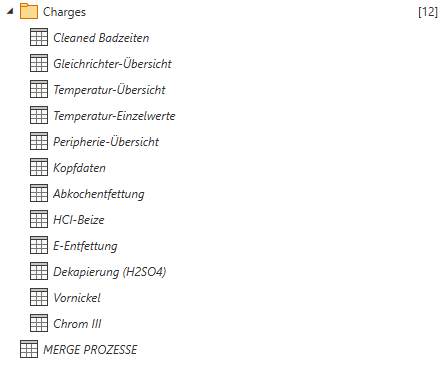

# Aufbau
**Betz-Chrom** schickt bisher 3 Arten von Excel Dateien.
- [[Betz-Chrom#Eingangs- & Ausgangsgrößen|Eingangsgrößen]]
- [[Betz-Chrom#Eingangs- & Ausgangsgrößen|Ausgangsgrößen]]
- [[Betz-Chrom#Charge Dateien|Charges]]

# Eingangs- & Ausgangsgrößen
Betz-Chrom sendet jeweils genau eine Datei dieser Art.
Diese beinhaltet grundlegendste Daten zum Experiment auf verschiedenen Tabellenblättern verteilt.
## Angewandte Schritte
Die standard Schritte der [[0 Iron-Schicht|Iron-Schicht]]
![[Join Query v2#Erklärung]]

# Charge Dateien
Betz-Chrom sendet viele Dateien dieser Art.
Diese beinhalten Automatisch generierte Maschienendaten von DiTec.

Die Daten werden so Transformiert, dass alle verwendbaren Daten hintereinander in einer Zeile geschrieben werden.
Jedes Ausführen des Dataflows schreibt die neun Daten unten an die bereits vorhandene Tabelle ran (Append)
Die [[Pipelines#Unterpipeline|Charge Pipeline]] sorgt dafür dass keine Daten doppelt verarbeitet werden und Orchestriert die Ausführung mit allen neuen Dateien.