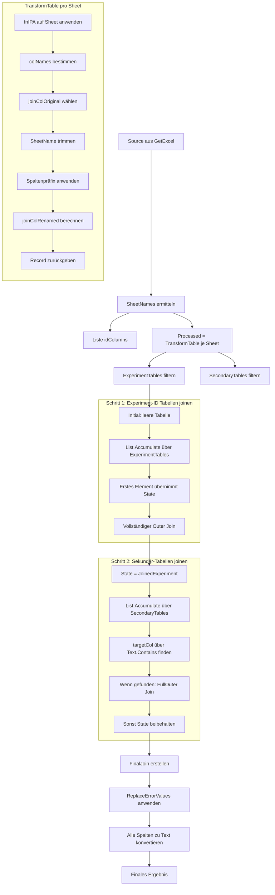

```mermaid
flowchart TD

    A[Source aus GetExcel] --> B[SheetNames ermitteln]
    B --> C[Liste idColumns]

    %% TransformTable
    subgraph S1[TransformTable pro Sheet]
        direction TB
        T1[fnIPA auf Sheet anwenden]
        T2[colNames bestimmen]
        T3[joinColOriginal wählen]
        T4[SheetName trimmen]
        T5[Spaltenpräfix anwenden]
        T6[joinColRenamed berechnen]
        T7[Record zurückgeben]
        T1 --> T2 --> T3 --> T4 --> T5 --> T6 --> T7
    end

    B --> D[Processed = TransformTable je Sheet]

    D --> E[ExperimentTables filtern]
    D --> F[SecondaryTables filtern]

    %% Join Experiment Tables
    subgraph S2[Schritt 1: Experiment-ID Tabellen joinen]
        direction TB
        G1[Initial: leere Tabelle]
        G2[List.Accumulate über ExperimentTables]
        G3[Erstes Element übernimmt State]
        G4[Vollständiger Outer Join]
        G1 --> G2 --> G3 --> G4
    end

    E --> G1

    %% Join Secondary Tables
    subgraph S3[Schritt 2: Sekundär-Tabellen joinen]
        direction TB
        I1[State = JoinedExperiment]
        I2[List.Accumulate über SecondaryTables]
        I3[targetCol über Text.Contains finden]
        I4[Wenn gefunden: FullOuter Join]
        I5[Sonst State beibehalten]
        I1 --> I2 --> I3 --> I4 --> I5
    end

    G4 --> I1

    I5 --> J[FinalJoin erstellen]

    J --> K[ReplaceErrorValues anwenden]
    K --> L[Alle Spalten zu Text konvertieren]
    L --> M[Finales Ergebnis]
```

