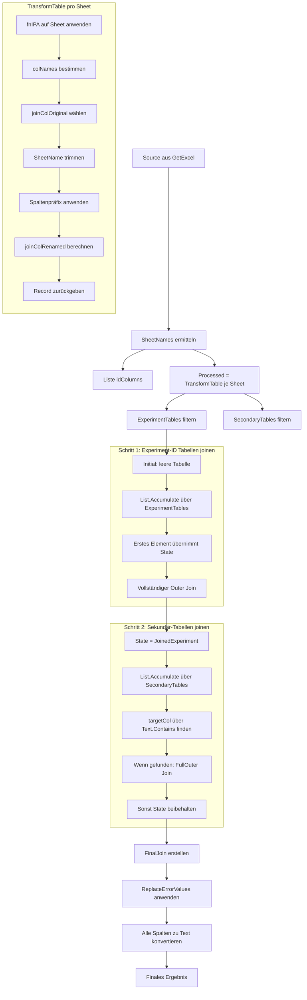

# Mermaid Diagramm
Die Query ist ein wenig komplex (und sicher nicht komplett effizient oder so), also hab ich es mal so als Mermaid dargestellt.


```pq
let
    Source = GetExcel,
    // Get the names of all Sheets
    SheetNames = fnFilterSheets(Source, {"ignore", "einheit", "ignorieren", "tabelle", "Vgl", "Data1"}),
    idColumns = {"Experiment"},

    //Function: Transform table
    TransformTable = (sheetName as text) =>
        let
            // Spezifischer "Reinigungsschritt" für alle Blätter
            tbl = fnHSAA(Source, {sheetName}, idColumns),
            colNames = Table.ColumnNames(tbl),
            joinColOriginal = 
                List.First(
                    List.Select(idColumns, each List.Contains(colNames, _)),
                    null),
            TrimmedSheetName = Text.Trim(Text.Trim(Text.Trim(Text.From(sheetName), " "), "."), "-"),
            renamedTbl = Table.TransformColumnNames(tbl, each TrimmedSheetName & "_" & _),
            joinColRenamed = if joinColOriginal <> null then TrimmedSheetName & "_" & joinColOriginal else null,
            result = [Table = renamedTbl, JoinCol = joinColRenamed, OriginalJoin = joinColOriginal]
        in
            result,

    Processed = List.Transform(SheetNames, each TransformTable(_)),
    ExperimentTables = List.Select(Processed, each [OriginalJoin] = idColumns{0}),
    SecondaryTables = List.Select(Processed, each [OriginalJoin] <> null and [OriginalJoin] <> idColumns{0}),

    // Schritt 1: Experiment-ID-Tabellen joinen
    JoinedExperiment = List.Accumulate(
        ExperimentTables,
        [Table = #table({}, {}), JoinCol = null],
        (state, current) =>
            if state[JoinCol] = null then
                current
            else
                let
                    Combined = Table.Join(state[Table], state[JoinCol], current[Table], current[JoinCol], JoinKind.LeftOuter)
                in
                    [Table = Combined, JoinCol = state[JoinCol]]
    ),

    // Schritt 2: Sekundäre Tabellen joinen
    FinalJoinRecord = List.Accumulate(
        SecondaryTables,
        JoinedExperiment,
        (state, current) =>
            let
                existingCols = Table.ColumnNames(state[Table]),
                targetCol = if current[OriginalJoin] <> null then
                                List.First(List.Select(existingCols, each Text.Contains(_, current[OriginalJoin])), null)
                            else
                                null,
                Combined = if targetCol <> null then
                                Table.Join(state[Table], targetCol, current[Table], current[JoinCol], JoinKind.LeftOuter)
                           else
                                state[Table]
            in
                [Table = Combined, JoinCol = state[JoinCol]]
    ),

    FinalJoin = if FinalJoinRecord[Table] <> null then FinalJoinRecord[Table] else #table({}, {}),


    ReplaceErrors = fnReplaceErrors(FinalJoin),
    Text = fnConvertAllColumnsToText(ReplaceErrors),
    Sanitize = fnSanitizeTable(Text)
in
    Sanitize
```