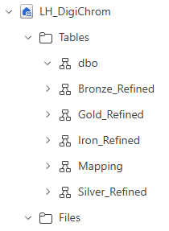

**DigiChrom** hat ein einzelnes **Lakehouse**, welches für jedes Layer ein **Schema** (bzw. Ordner) (Nicht das [[Allgemeine Probleme#Schema drift|Schema]], sondern heißen so einfach diese "Tabellenordner")
Zusätzlich existiert ein **Schema für die Mapping-Tabelle"**, welches von dem [[Mapping Dataflow]] bespielt wird. Dort befindet sich also die bereinigte Mapping-Tabelle zur Benutzung in [[1 Bronze-Schicht|Bronze]], [[2 Silver-Schicht|Silver]], [[3 Gold-Schicht|Gold]].