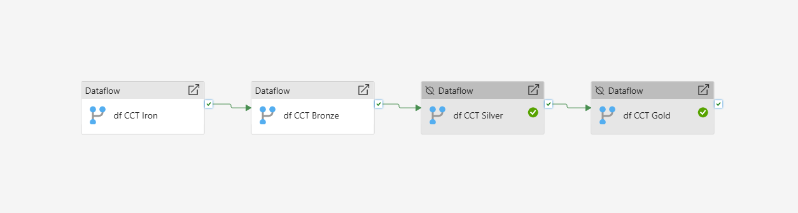
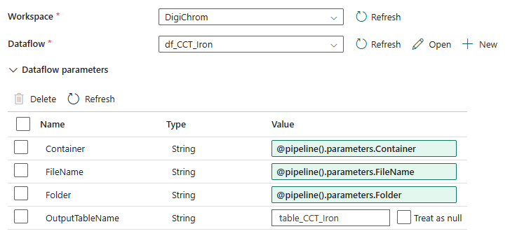
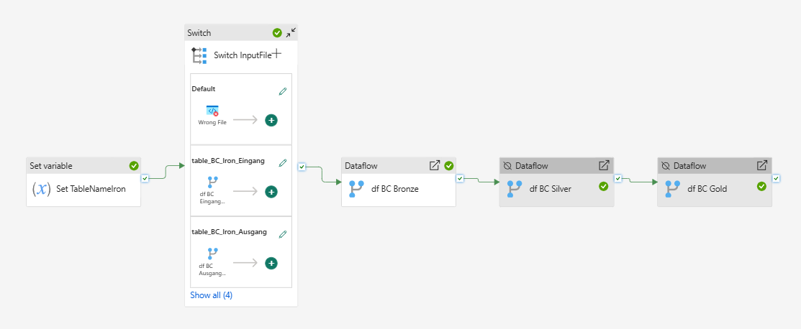
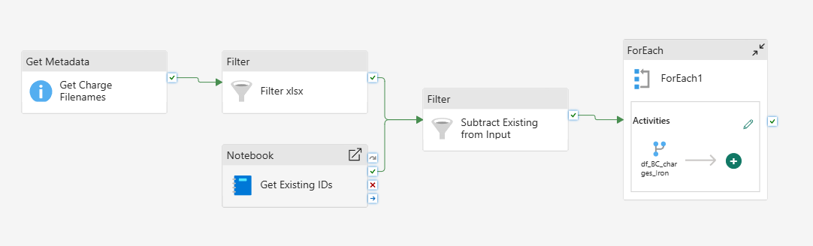

**Pipelines** sind unser main Tool zur Orchestrierung der Dataflows. D.h. Pipelines sind dafür Zuständig die richtigen [[Dataflows]] in der richtigen Reihenfolge zu *reloaden*[^1], den [[Dataflows]] die richtigen Parameter zu geben, logging, ...

[^1]: **Wichtig:** Dataflows können *reloaded* werden und *gepublished* werden. Beides ist unterschiedlich!! [[Allgemeine Probleme#Schema drift|Mehr dazu]]
# Trigger Pipeline
![[Pipeline Example.excalidraw|2000x100]]
Dier ist die **Trigger Pipeline**. Sie wird vom [[EventGrid]] gestartet. Speichert sich die empfangenen Daten in Variablen *(Container, Folder, FileName)* und startet anhand des Containers die dazugehörige [[Pipelines#Partner Pipeline|Partner Pipeline]].
Notifications nach außen via Mail oder Teams finden ebenfalls hier statt.
# Partner Pipeline

Ungefähr so sehen die **Standard Pipelines jedes Partners** aus.
Diese bekommen die Variablen der [[Pipelines#Trigger Pipeline|Trigger Pipeline]] als Parameter übergeben. 
In der Pipeline werden einfach die verschiedenen [[Dataflows]] der [[Medallion Modell#Die Schichten|Schichten]] aufgerufen. Diesen muss man die Parameter noch übergeben:

# Spezielle Partner Pipeline

[[Betz-Chrom#Charge Dateien|Betz-Chrom]] hat eine **spezielle Pipeline**, da Sie mehr als eine Datei liefern. Dadurch sind somit mehrere [[0 Iron-Schicht|Iron Dataflows]] benötigt (Für jede Art von Datei einer).
Je nachdem welche Art von Datei ankommt *(wird in `Set TableNameIron` und `Switch InputFile` geprüft)* wird der jeweilige Dataflow ausgeführt bzw. die jeweilige Unterpipeline gestartet.

## Unterpipeline

[[Betz-Chrom#Charge Dateien|Betz-Chrom]] liefert Charge-Dateien, diese müssen gesondert behandelt werden.
Dieser Dataflow liest mit `Get Charge Filenames` alle Dateien aus dem Blobstorage aus, welche bei Betz-Chrom in *00_Upload_Table/Charges* liegen und Filtert mit `Filter xlsx` nach Dateien, welche auf .xlsx enden.
Die bereits verarbeiteten Charge IDs werden in `Get Existing IDs` ausgelesen und mit der ID ,aus den Dateinamen, der neu gelesenen Dateien, in `Substract Existing from Input` verglichen.

-> So wird dann für jede Datei mit neuer ID einmal der [[Betz-Chrom#Charge Dateien|Charge Dataflow]] aufgerufen.