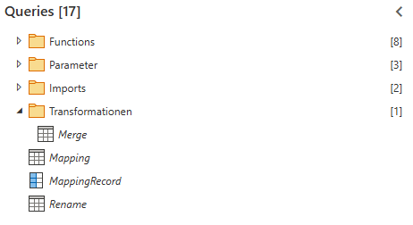

# Ziel der Bronze Schicht
**Ziel** ist es aus *jeder Iron-Tabelle* eines Partners eine große zu kreieren und diese zu vereinheitlichen bzw. das Mapping der Mapping-Tabelle anwenden.
# Aufgabe
Aufgabe der Typischen [[1 Bronze-Schicht|Bronze-Schicht]] ist es:
1. Falls Partner mehrere Iron-Tabellen erzeugt ([[Betz-Chrom]]), müssen diese gemerged werden.
2. Tabelle nach Mapping umbenennen und 1..n Beziehungen auflösen ([[Mapping v2]])
## TODO
- Gemappte Einheitsspalten hinzufügen, falls nicht bereits vorhanden (bisher in Silver)
- Typen der Spalten aus Mapping entnehmen und Spalten entsprechend Typisieren
## Beispiel
Anhand von [[Betz-Chrom]]:

# Funktionen
![[1 Bronze Functions.base]]