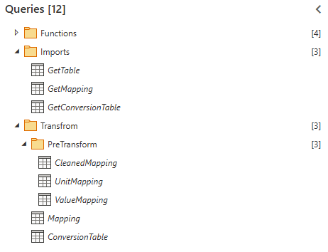

# Ziel der Silver Schicht
**Ziel** ist es aus *die Bronze Tabellen* der Partners untereinender zu vereinheitlichen und alle möglichen Rechenschritte durchzuführen.
# Aufgabe
Aufgabe der Typischen [[2 Silver-Schicht|Silver-Schicht]] ist es:
1. Spalten für gemappte Einheiten hinzufügen (sollte nach Bronze verschoben werden)

## TODO
- Einheiten auf Mastereinheit umrechnen und Einheiten in den Einheitsspalten korrigieren
- z.B. Mittelwerte für Messpunkte usw. berechnen
## Beispiel
Anhand von [[IPA]]:

| Unit_Ontologiename                                                       | Master_Unit | Partner_Unit | Is_Unit_Mapped | Value_Ontologiename                                                 |
| ------------------------------------------------------------------------ | ----------- | ------------ | -------------- | ------------------------------------------------------------------- |
| 01_PreparationSubstrate-UnitSymbol (SpecimenDiameter, process data set)  | mm          | mm           | TRUE           | 01_PreparationSubstrate-Value (SpecimenDiameter, process data set)  |
| 10_PlatingChromium-UnitSymbol (TemperatureActual, process data set)      | c           | c            | FALSE          | 10_PlatingChromium-Value (TemperatureActual, process data set)      |
| 01_PreparationSubstrate-UnitSymbol (SpecimenThickness, process data set) | mm          | mm           | TRUE           | 01_PreparationSubstrate-Value (SpecimenThickness, process data set) |
So oder so Ähnlich sieht die Tabelle aus der Query `Mapping` aus.
Die Tabelle hat 5 Spalten:
1. **Unit_Ontologiename:** Der Name der Spalte in der Bronze-Tabelle
2. **Master_Unit:** Die Master-Einheit zu dieser Spalte
3. **Partner_Unit:** Die Einheit, welche der Partner liefert
4. **Is_Unit_Mapped:** Existiert die Spalte bereits in der Tabelle des Partners? (`True/False`)
5. **Value_Ontologiename:** Die zugehörige Value-Spalte, wessen Wert umgerechnet werden muss

-> Hierauf kann aufgebaut werden um die Werte zu den Mastereinheiten umrurechnen.

# Funktionen
![[2 Silver Functions.base]]