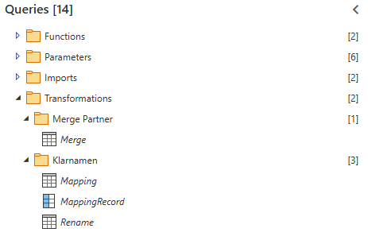

# Ziel der Gold Schicht
**Ziel** ist es *die Silver-Tabellen* einer Partnergruppe *(Hart, Deko, Dispersion)* aneinander zu hängen (append).
# Aufgabe
Aufgabe der Typischen [[3 Gold-Schicht|Gold-Schicht]] ist es (je nach Usecase) z.B.:
- Spalten, welche nicht im Mapping liegen rauszuwerfen *(Spalten welche mit "xx_" starten)*
- Silver-Tabellen der Partnergruppe aneinander zu hängen (append)
- Tabellen auf Klarnamen umbenennen
- ...
## Beispiel
Anhand eines POCs:

- In **Merge** werden die nur aneinander gehängt (append)
- Alles im Ordner **Klarnamen** ist eine Modifizierte Version von [[Mapping v2]], welche aber diesmal nicht Partnername nach Ontologie umbenennt, sondern Ontologie nach Klarname (Spalten vertauscht)
# Funktionen
![[3 Gold Functions.base]]